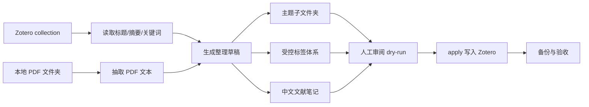

# Zotero Literature Organizer

<h2 align="center">把混乱的 Zotero 文献库，整理成可写综述的研究工作台</h2>

<p align="center">
  
  
  
  
</p>

<p align="center">
  <a href="#它解决什么痛点">痛点</a> ·
  <a href="#它会产出什么">产出</a> ·
  <a href="#快速开始">快速开始</a> ·
  <a href="#工作流">工作流</a> ·
  <a href="#安全模型">安全模型</a> ·
  <a href="#命令参考">命令参考</a>
</p>

> Zotero 能帮你收藏论文，但不一定能帮你“组织研究”。这个 Skill 想做的事情是：把一堆散乱文献整理成能直接支撑综述、开题和选题判断的结构化知识空间。

`zotero-literature-organizer` 是一个面向 Codex 的 Zotero 文献整理 Skill。它读取 Zotero collection、论文标题、摘要、关键词和本地 PDF，先生成一个可审阅的整理草稿，再在你确认后把 Zotero 文献库整理成：

- 少量主题子文件夹
- 不超过 10 个高复用标签
- 每篇文献一条中文解读笔记
- 可回看的 JSON / Markdown 草稿
- 写入前的 Zotero 数据库备份

它适合任何“文献增长速度超过整理速度”的研究者，尤其适合调度优化、强化学习、智能制造、图神经网络、多目标优化等论文密集方向。

## 它解决什么痛点

很多 Zotero 文献库最后都会变成这样：

- 文件夹越建越多，但每个文件夹边界越来越模糊。
- 标签越打越多，最后 80 个标签谁也不想再用。
- 新论文读完不知道该放到哪里，只能先扔进“未分类”。
- 写综述时才发现：文献有了，结构没有。
- Zotero 自动化工具很多，但大多停在导入、导出、同步，没有帮你做研究组织。

这个 Skill 的目标不是“帮你多建几个文件夹”，而是把文献库整理成一个更像综述提纲的研究工作台。

## 它会产出什么

针对一个目标 Zotero collection，它会生成：

| 产出 | 规则 |
| --- | --- |
| 主题子文件夹 | 少量高层主题，默认 3-5 个 |
| 标签体系 | 控制词表，默认最多 10 个 |
| 中文解读笔记 | 每篇文献一条 Zotero 子笔记 |
| 整理草稿 | JSON + Markdown，写入前可审阅 |
| 数据库备份 | apply 前备份 `zotero.sqlite` |

默认笔记结构强调 5 个维度：

```text
1. 困境/难点
2. 方法
3. 解决的问题
4. 效果对比
5. 原理与创新点
```

如果你要写综述，这些内容可以直接帮你回答：这篇文献属于哪个研究方向？它解决了什么问题？和其他方法相比有什么差异？为什么值得放进这一类？

## 一个典型整理结果

假设你的 Zotero 文件夹里是一批“调度优化 + 深度强化学习”论文，它可能生成这样的结构：

**主题子文件夹**

```text
动态扰动调度
图网络与注意力机制
多智能体协同调度
多目标与资源约束
综述与研究趋势
```

**标签体系**

```text
深度强化学习
多智能体强化学习
图神经网络
Transformer 与注意力
动态扰动
多目标优化
分布式与运输
柔性作业车间
人机资源约束
综述与前沿
```

**单篇文献笔记**

```text
困境/难点：传统派工规则依赖局部信息，面对新工件到达、设备故障和运输冲突时容易失效；元启发式算法虽然能重新优化，但在线计算成本高。

方法：论文将车间状态编码为图结构，用深度强化学习根据当前工序、机器负载和动态事件选择调度动作，并与规则方法和智能优化算法比较。

原理与创新点：核心价值在于把动态调度从“每次扰动后重新求解”转化为“学习状态到动作的快速映射”，从而提高实时响应能力。
```

## 快速开始

把仓库克隆到 Codex 的 skills 目录：

```powershell
cd $env:USERPROFILE\.codex\skills
git clone https://github.com/ZJ55668899/zotero-literature-organizer.git
```

重启 Codex 后，你可以直接说：

```text
Use $zotero-literature-organizer to organize my Zotero collection named 调度优化, using PDFs in the current folder. Generate a dry-run draft first.
```

中文也可以：

```text
使用 $zotero-literature-organizer 整理 Zotero 里名为“调度优化”的 collection，结合当前文件夹里的 PDF，先生成草稿，不要直接写入。
```

## 推荐使用方式

```text
使用 $zotero-literature-organizer 整理 Zotero collection：调度优化。

我的研究方向：
动态柔性作业车间调度、深度强化学习、多智能体、图神经网络、多目标优化。

整理要求：
- 先 dry-run，不要直接写入 Zotero
- 子文件夹控制在 5 个以内
- 标签控制在 10 个以内
- 标签要能复用，不要为每篇论文单独造标签
- 每篇文献生成中文解读笔记
- 最后给我 JSON 和 Markdown 草稿，确认后再 apply
```

## 工作流



这个流程的关键是：**先草稿，后写入**。它不会一上来就改你的 Zotero 数据库。

## Dry-run 与 Apply

### Dry-run：先看方案

```powershell
python scripts\organize_zotero_collection.py `
  --collection-name "调度优化" `
  --pdf-dir "D:\your\paper-folder"
```

会生成：

```text
zotero-literature-organizer-draft.json
zotero-literature-organizer-draft.md
```

你可以先检查：

- 子文件夹是否合理
- 标签是否太泛或太碎
- 文献是否分错类
- 笔记是否抓住了核心方法和创新点

### Apply：确认后写入

```powershell
python scripts\organize_zotero_collection.py `
  --collection-name "调度优化" `
  --pdf-dir "D:\your\paper-folder" `
  --apply
```

如果多个 Zotero collection 同名，使用：

```powershell
--collection-key <Zotero collection key>
```

## 安全模型

这个项目默认服务本地 Zotero Desktop，不走 Zotero 云 API。

### Dry-run 模式

- 通过 `http://127.0.0.1:23119/api/` 读取 Zotero。
- 读取本地 PDF 文本。
- 只写出 JSON / Markdown 草稿。
- 不修改 Zotero 数据库。

### Apply 模式

- 写入前关闭 Zotero Desktop，避免数据库锁。
- 从 profile preference 中定位真实 Zotero data directory。
- 备份 `zotero.sqlite`。
- 创建或复用子 collection 和 tags。
- 为每篇文献创建或更新一条笔记。
- 默认重启 Zotero，除非传入 `--keep-zotero-closed`。

## 命令参考

```powershell
python scripts\organize_zotero_collection.py `
  --collection-name "调度优化" `
  --pdf-dir "." `
  --max-subcollections 5 `
  --max-tags 10 `
  --draft-out zotero-literature-organizer-draft.json `
  --note-title "调度研究解读（Codex）"
```

常用参数：

| 参数 | 作用 |
| --- | --- |
| `--collection-name` | 按显示名称选择 Zotero collection |
| `--collection-key` | 按 Zotero key 精确选择 collection |
| `--pdf-dir` | 本地 PDF 文件夹 |
| `--max-subcollections` | 最大主题文件夹数，默认 5 |
| `--max-tags` | 最大标签数，默认 10 |
| `--draft-out` | JSON 草稿输出路径 |
| `--note-title` | 要创建或更新的 Zotero 笔记标题 |
| `--apply` | 将草稿写入 Zotero |
| `--keep-zotero-closed` | apply 后不重启 Zotero |

## 适合的使用场景

- 新建一个课题方向的文献库。
- 把“未分类”文献整理成综述结构。
- 给一批论文生成统一风格的中文研究解读。
- 为开题报告准备方法分类、研究趋势和关键文献表。
- 控制 Zotero 标签数量，避免标签体系失控。

## 不适合做什么

- 不适合在完全没有人工审阅的情况下批量改大型文献库。
- 不适合替代最终的人工文献分类判断。
- 不适合把每篇论文全文翻译成中文，它产出的是研究组织笔记。
- 不适合 Zotero 条目质量很差、标题缺失严重且没有本地 PDF 的场景。

## 仓库结构

```text
zotero-literature-organizer/
├─ SKILL.md
├─ README.md
├─ agents/
│  └─ openai.yaml
├─ references/
│  └─ workflow.md
└─ scripts/
   └─ organize_zotero_collection.py
```

## Roadmap

- 更强的多语言笔记模板。
- 用户可编辑的标签词表。
- 更直观的草稿预览界面。
- 基于备份的安全回滚助手。
- 可导出的文献综述矩阵表。

## Star 趋势

[](https://www.star-history.com/#ZJ55668899/zotero-literature-organizer&Date)

## 一句话

如果 Zotero 是你的文献仓库，那么这个 Skill 想做的是：把仓库整理成你真正能用来写综述、做开题、找研究缺口的工作台。